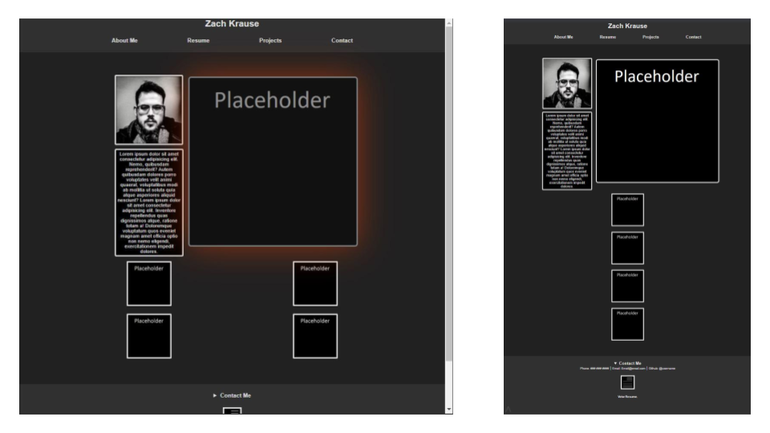

# CSS-Portfolio-ZK: Portfolio Assignment - 20210525

## Overview
Tasked to create a usable portfolio page for myself. Primary function will be to showcase work done throughout ASU coding Bootcamp.

## Given Criteria
* Presents name, photo, section about them, projects, contact information.
* Clicking navigation scrolls to the corresponding section.
* First project image should be larger in size than the others.
* Project images link to corresponding project pages. (Placeholder used at this time.)
* Responsive layout that adapts when resizing the page.


## Design


Used simple grayscale color scheme for pages main construction, red shadow appears only while hovering over an image with a link. 
Page layout is responsive, reorganizing the page into a single column of content if the window is scaled down.

.png)

Primary project image displayed larger than the others even while scaling down.

.png)

Nav bars react on hover and contact options open from a drop down list.


## Links
[REPOSITORY](https://github.com/ZacharyWK/CSS-Portfolio-ZK)
```
https://github.com/ZacharyWK/CSS-Portfolio-ZK
```

[DEPLOYED](https://zacharywk.github.io/CSS-Portfolio-ZK/)
```
https://zacharywk.github.io/CSS-Portfolio-ZK/
```
